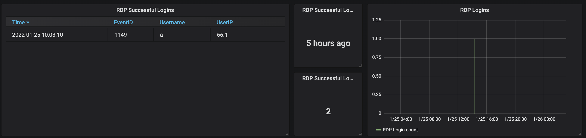

# Monitor Successful RDP Logins To Windows VM

Monitor successful RDP logins to a Virtual Machine. Consist of two parts:

-   Scheduled Task that monitors Microsoft Event logs for Event ID: 1149
-   A powershell script that gets triggered when the Event is found
    -   The script, writes a log file on disk
    -   Sends an `Invoke-WebRequest` to an Influxdb server (to be visualized with Grafana for setting alerts)