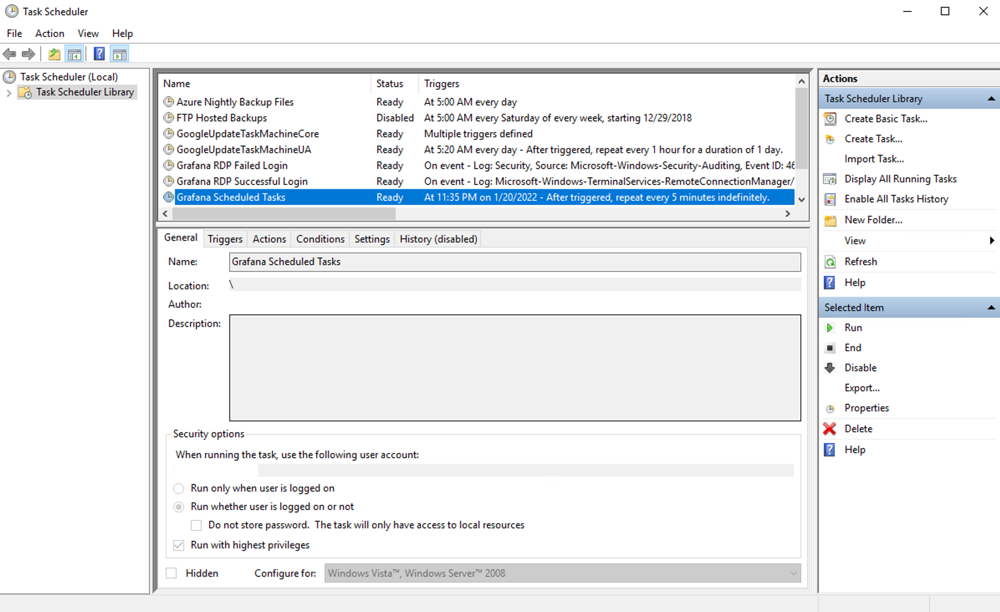
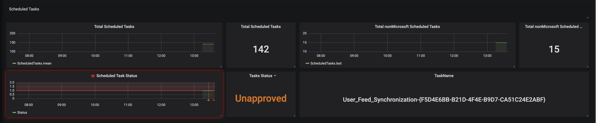
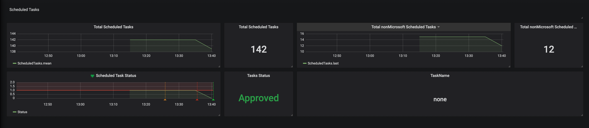

Scheduled Tasks are a great way to run scripts at specified time intervals. Similar to Unix cron. Because it's such a powerful tool, it can be easy to abuse by programs that install their own schedule tasks. Most times without any transparency to the user that a task is being created. It's also a potential target for malware to install persistent tasks that go unnoticed.

On managed servers, I want transparency into which tasks are installed. I created a powershell script with an array of "white listed" tasks, then created a scheduled tasks to check the name of the scheduled tasks installed. The results are sent to InfluxDB and If a task is not on my white list, an alert is sent with Grafana.

When first installed, it reports the `total number` of scheduled tasks, and `total number of non-Microsoft` tasks. By default, I ignore Microsoft tasks installed on a new install. 

In this scenario you can see an alert has been triggered, because there is an `Unapproved` task, and to the right, it shows the name of the task, `User_Feed_ ...`

Now you can log into the computer and check the task to decided if it needs added to your white list or deleted.

Once the task has been deleted, the alarm is cleared and all tasks report as `Approved`
